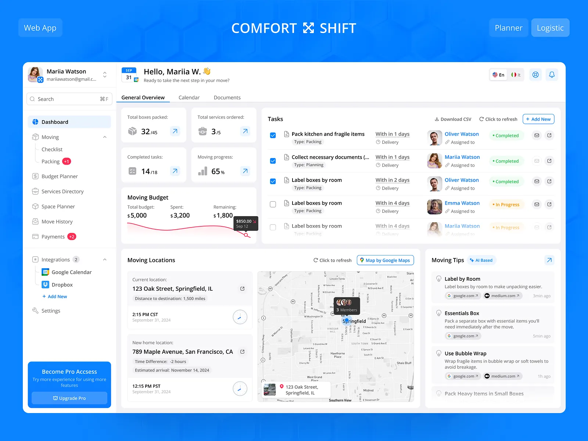
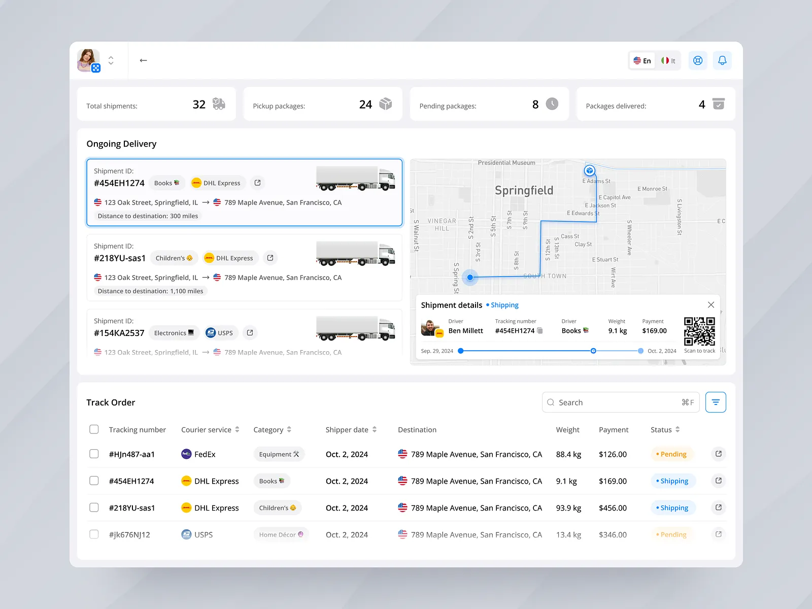

# Supply Setu

## About The Project

Supply Setu is a comprehensive supply chain management platform specifically designed for street food vendors. The name "Setu" means "bridge" in Hindi, representing our mission to connect vendors with the best suppliers and ingredients.




### ✨ Key Features

#### 🔐 **Authentication & User Management**
- **Multi-Role System**: Vendor, Supplier, and Admin roles with role-based access control
- **Secure JWT Authentication**: Robust token-based authentication system
- **Admin Portal**: Complete admin dashboard for user approval, management, and analytics
- **User Approval Workflow**: Pending → Approved → Active user flow with status tracking

#### 🏪 **For Vendors**
- **Nearby Suppliers**: Find suppliers in your area with competitive prices
- **Product Management**: Add, edit, and manage your food products
- **Order Management**: Track and manage supplier orders
- **Dashboard Analytics**: View sales metrics and business insights

#### 📦 **For Suppliers**
- **Business Profile Management**: Complete supplier profile with verification system
- **Product Catalog**: Manage your product offerings and inventory
- **Order Processing**: Handle vendor orders efficiently
- **Rating & Reviews**: Build trust through customer feedback

#### 👨‍💼 **Admin Portal**
- **User Approval System**: Approve/reject vendor and supplier registrations
- **User Management**: View, edit, and manage all platform users
- **Platform Analytics**: Dashboard with user statistics and platform metrics
- **Supplier Verification**: Verify and manage supplier credentials

#### 🌐 **Additional Features**
- **Responsive Design**: Optimized for desktop, tablet, and mobile devices
- **Geolocation Features**: Location-based supplier discovery
- **Rating & Reviews**: Authentic feedback system for suppliers
- **Secure Data Storage**: MongoDB with proper data validation
- **Error Handling**: Comprehensive error handling and user feedback

## 🛠️ Technology Stack

### Frontend
- **React 18** with Vite for fast development
- **TailwindCSS 4.0** for modern, responsive styling
- **React Router** for client-side routing
- **React Hook Form** for form management
- **Axios** for API communication

### Backend
- **Node.js** with Express.js framework
- **MongoDB** with Mongoose ODM
- **JWT** for secure authentication
- **bcryptjs** for password hashing
- **CORS** enabled for cross-origin requests

### Development Tools
- **ES6+ Modules** throughout the project
- **Environment Variables** for configuration
- **RESTful API** design patterns

## 🚀 Getting Started

### Prerequisites

- **Node.js** (version 18 or higher)
- **npm** (version 9 or higher)
- **MongoDB** (local installation or MongoDB Atlas)

### Installation

1. **Clone the repository:**
   ```bash
   git clone https://github.com/ManishKrBarman/Supply-Setu.git
   cd Supply-Setu
   ```

2. **Install frontend dependencies:**
   ```bash
   cd client
   npm install
   ```

3. **Install backend dependencies:**
   ```bash
   cd ../server
   npm install
   ```

4. **Set up environment variables:**
   
   Create a `.env` file in the `server` directory:
   ```env
   PORT=3005
   MONGO_URI=your_mongodb_connection_string
   JWT_SECRET=your_jwt_secret_key
   ```

### 🎯 Running the Application

#### Option 1: Manual Start (Recommended)

1. **Start the backend server:**
   ```bash
   cd server
   npm start
   ```

2. **Start the frontend (in a new terminal):**
   ```bash
   cd client
   npm run dev
   ```

3. **Access the application:**
   - **Frontend**: http://localhost:5173
   - **Backend API**: http://localhost:3005

#### Option 2: Quick Setup with Admin

Start server with automatic admin creation:
```bash
cd server
node start-with-admin.js
```

#### Option 3: Create Admin User Only

```bash
cd server
node quick-admin.js
```

### 👤 Default Admin Credentials

After running the admin setup:
- **Email**: admin@supplysetu.com
- **Password**: admin123

### 🔗 Important URLs

- **Frontend**: http://localhost:5173
- **Admin Portal**: http://localhost:5173/admin/login
- **API Health Check**: http://localhost:3005/api/health

## 📱 User Roles & Access

### 🛒 **Vendor**
- Register business and manage profile
- Browse and connect with suppliers
- Manage product catalog
- Place and track orders
- Access to vendor dashboard

### 📦 **Supplier**
- Register business and get verified
- Manage product inventory
- Process vendor orders
- Build reputation through ratings
- Access to supplier dashboard

### 👨‍💼 **Admin**
- Approve/reject user registrations
- Manage all platform users
- View platform analytics
- Verify supplier credentials
- Full system access

## 🌟 Project Status

### ✅ **Completed Features**
- [x] Complete authentication system (login, register, JWT)
- [x] Multi-role user management (Vendor, Supplier, Admin)
- [x] Admin portal with user approval workflow
- [x] User registration and profile management
- [x] Role-based access control and route protection
- [x] Responsive UI with TailwindCSS
- [x] MongoDB integration with proper schemas
- [x] Error handling and validation
- [x] API endpoints for all major operations

### 🚧 **In Progress**
- [ ] Real-time notifications
- [ ] Advanced analytics dashboard
- [ ] File upload for product images
- [ ] Payment integration
- [ ] Advanced search and filtering

## 📁 Project Structure

```
supply-setu/
├── client/                     # Frontend React application
│   ├── public/                 # Static assets
│   ├── src/
│   │   ├── admin/              # Admin-specific components
│   │   ├── api/                # API service functions
│   │   ├── components/         # Reusable UI components
│   │   ├── layouts/            # Page layout components
│   │   ├── pages/              # Main page components
│   │   └── utils/              # Utility functions
│   ├── package.json
│   └── vite.config.js
│
├── server/                     # Backend Node.js application
│   ├── controllers/            # Request handlers
│   ├── middleware/             # Express middleware
│   ├── models/                 # MongoDB/Mongoose models
│   ├── routes/                 # API route definitions
│   ├── quick-admin.js          # Admin user creation script
│   ├── start-with-admin.js     # Server startup with admin creation
│   ├── package.json
│   └── .env                    # Environment variables
│
├── README.md
└── package.json
```

## 🔧 API Endpoints

### Authentication
- `POST /api/users/register/vendor` - Register as vendor
- `POST /api/users/register/supplier` - Register as supplier
- `POST /api/users/login` - User login
- `GET /api/users/profile` - Get user profile

### Admin
- `GET /api/admin/stats` - Platform statistics
- `GET /api/admin/users/pending` - Pending user approvals
- `PUT /api/admin/users/:id/approve` - Approve user
- `PUT /api/admin/users/:id/reject` - Reject user

### Suppliers
- `GET /api/suppliers` - Get all suppliers
- `GET /api/suppliers/:id` - Get supplier by ID

## 🧪 Testing

### Test Admin Creation
```bash
cd server
node quick-admin.js
```

### Test API Endpoints
```bash
cd server
node test-endpoints.js
```

## 🤝 Contributing

Contributions are welcome! Please follow these steps:

1. **Fork the Project**
2. **Create your Feature Branch** (`git checkout -b feature/AmazingFeature`)
3. **Commit your Changes** (`git commit -m 'Add some AmazingFeature'`)
4. **Push to the Branch** (`git push origin feature/AmazingFeature`)
5. **Open a Pull Request**

## 📄 License

Distributed under the MIT License. See `LICENSE` for more information.

## 📞 Contact

**Project Link**: [https://github.com/ManishKrBarman/Supply-Setu](https://github.com/ManishKrBarman/Supply-Setu)

---

**Built with ❤️ for the street food vendor community**
